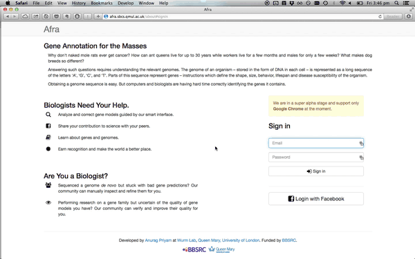

# Crowdsourcing Genome Annotation

[bmpvieira.com/ccs14](//bmpvieira.com/ccs14)

Bruno Vieira | [@bmpvieira](//twitter.com/bmpvieira)

Queen Mary, University of London

---

## What is genome annotation?

---

### Demo

[afra.sbcs.qmul.ac.uk](http://afra.sbcs.qmul.ac.uk)

---

## Afra
Web App to Crowdsource/Gamify Genome Annotation

---

### Open Source

[github.com/yeban/afra](//github.com/yeban/afra)

Anurag Priyam

[@yeban](//twitter.com/yeban)

---

### WebApollo

[github.com/gmod/apollo](//github.com/gmod/apollo)

[apollo.berkeleybop.org](//apollo.berkeleybop.org)

---

### Software Stack

---

### Bionode

[github.com/bionode/bionode](//github.com/bionode/bionode)

---

### Gamify

* Scores
* Open Badges
* Certificates of Expertise

---

### Machine Learning

Use data generated by users to improve gene prediction models

---

### Thanks! Questions?

Bruno Vieira
[@bmpvieira](//twitter.com/bmpvieira)

Anurag Priyam
[@yeban](//twitter.com/yeban)

Yannick Wurm
[@yannick__](//twitter.com/yannick__)

[bmpvieira.com/ccs14](//bmpvieira.com/ccs14)

<small>
© 2014 [Bruno Vieira](//bmpvieira.com) [CC-BY 4.0](//creativecommons.org/licenses/by/4.0/deed.en_US)
</small>